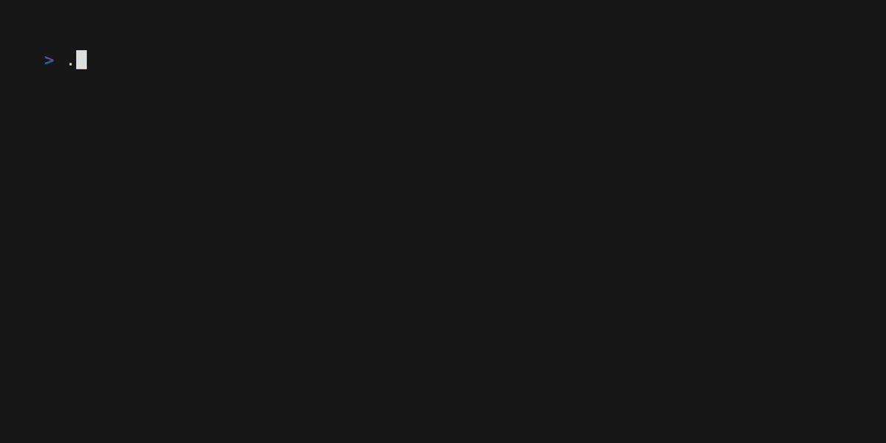

# DockStack

TUI (terminal) en Go pour gérer des stacks Docker Compose : lister les stacks
détectées, les démarrer/arrêter/redémarrer/recréer, pull les images, suivre
les logs, et capturer/restaurer l'état des stacks en cours d'exécution.



## ⚠️ Avertissement important

**Ce projet est entièrement vibecodé** : tout le code a été généré par un
agent IA (Claude / Claude Code), aucune ligne n'a été écrite à la main par un
développeur humain.

Je relis et corrige au fur et à mesure les bugs que je rencontre dans mon
usage quotidien.

**Utilisez ce projet à vos propres risques**, idéalement sur un environnement
où une erreur n'a pas de conséquence grave. Relisez le code vous-même avant
de l'utiliser sur des stacks importantes.

## Fonctionnalités

- Liste des stacks Docker Compose détectées, groupées par dossier, avec état
  (running / stopped / unhealthy) et compte de conteneurs
- Actions : Up, Down, Restart, Recreate, Pull, Remove (avec confirmation),
  Logs
- Actions groupées sur une sélection multiple ou un dossier entier
- Vue de progression en temps réel pendant les opérations, façon
  `docker compose` en CLI
- Captures d'état (« active stacks ») et restauration sélective
- Filtrage / recherche dans la liste des stacks

## Prérequis

- Accès au socket Docker (le binaire utilise l'API `docker/compose/v5`, pas
  le binaire `docker compose`)
- Pour compiler depuis les sources : Go 1.26+

## Installation

Binaire statique linux/amd64, sans dépendance :

```bash
curl -L https://github.com/Bloopps/DockStack/releases/latest/download/dockstack-linux-amd64 -o dockstack
chmod +x dockstack
./dockstack
```

## Lancer depuis les sources

```bash
go run ./cmd/dockstack
```

## Configuration

Fichier `~/.dockstack/config.json` (créé automatiquement au premier
lancement) :

```json
{
  "stack_dir": "/chemin/vers/vos/stacks",
  "max_parallel": 4
}
```

- `stack_dir` : dossier racine scanné pour trouver les fichiers
  `compose.yaml` / `compose.yml` / `docker-compose.yml`
- `max_parallel` : nombre d'opérations simultanées lors des actions groupées

## Raccourcis principaux

| Touche                | Action                                              |
|-----------------------|-----------------------------------------------------|
| `u` / `d` / `r` / `c` / `p` | Up / Down / Restart / Recreate / Pull          |
| `l`                   | Logs de la stack courante                            |
| `↩`                   | Panneau d'actions (dont Remove)                      |
| `␣`                   | Sélectionner                                         |
| `ctrl+a`              | Tout sélectionner (visible)                          |
| `esc`                 | Désélectionner / fermer                              |
| `←` / `→`             | Replier / déplier un groupe                          |
| `/`                   | Filtrer                                              |
| `R`                   | Rafraîchir (auto toutes les 15 s)                    |
| `b`                   | Captures d'état                                      |
| `o`                   | Changer de répertoire                                |
| `?`                   | Aide                                                 |
| `q`                   | Quitter                                              |

## Régénérer la démo

Le GIF en haut du README est généré avec [VHS](https://github.com/charmbracelet/vhs) :

```bash
go build -o dockstack ./cmd/dockstack
vhs demo.tape
```
